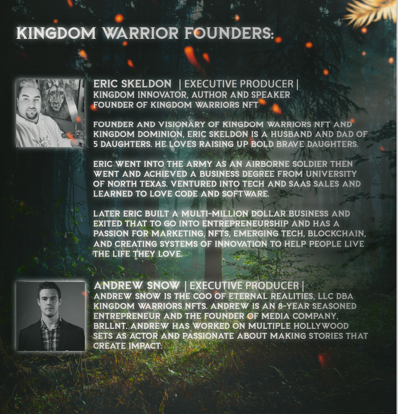
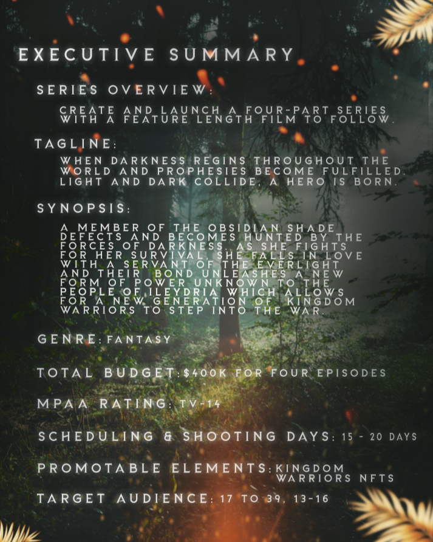
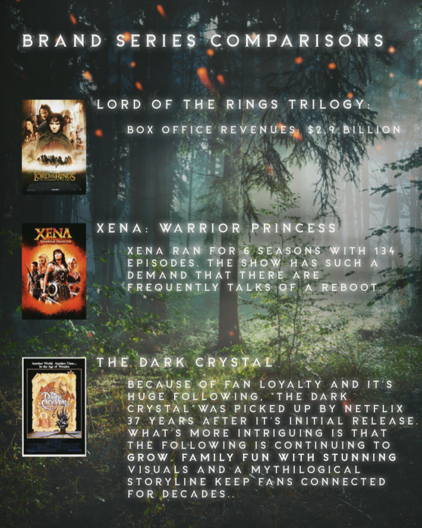

# 🎬 The Kingdom Warriors Movie

**Web3 represents collaboration, customization, and communal prosperity; so what place does Web3 have within the existing cinematic and movie ecosystem? If the RIAA is the cerberus at the gates of the music industry, the major five studios (Disney, Universal, Warner Bros., Paramount/CBS, & Sony) are the guardians protecting the treasure of Hollywood Cinema through the Studio System. The Studio System is a business method where Hollywood movie studios control all aspects of their film productions, including production, distribution, and exhibition.**

> “The Studio System is a business method where Hollywood movie studios control all aspects of their film productions, including production, distribution, and exhibition.”

Dominated by the **Big Five studios**, all personnel including cast and crew used to be under contract to the studios. It made efficient and “assembly-line” style filmmaking that was quintessential to the breakthrough of film as the dominant entertainment medium for most of the 20th century. The studio system was even more consolidated than what we see today (although streaming has done wonders for returning studios to their control).

The Big Five Studios of the early 20th century (Golden Age) were Metro-Goldwyn-Mayer, Warner Bros., Paramount, Fox, and RKO. They were all “vertically integrated” which meant that production, distribution, and exhibition were handled within each studio. **This, effectively, removed any competition from ever being able to compete within Hollywood.** Just as oil, steel, and railroads had an oligopoly that led to the term “Guilded Age” at the turn of the 21st century, the same conditions led to what Hollywood called the Golden Age.

Each studio owned all of it's own movie theaters and in order for their movies to be shown in theaters that they didn’t own, they used a practice called **“block booking.”** Block booking involved selling a portfolio of five movies to be shown in movie theaters they didn’t own. One movie was good while the other four were mediocre or even bad. Since it was an “all or nothing” deal, many of these independent theaters took whatever they were offered so they could show movies in their local communities all across the country.

**Fast-forward** to the modern day where, a century later, there are once again The Big Five Studios that run the world of entertainment. This time, rather than owning their own theaters, The Big Five Studios own their own streaming platforms (Disney+, Peacock, HBOMax, Paramount+, and Sony Playstation Network).

> **“This time, rather than own their own theaters, The Big Five Studios own their own streaming platforms (Disney+, Peacock, HBOMax, Paramount+, and Sony Playstation Network).”**

If they want their movies to be seen in other locations, they license the rights to their films to third-party players that sell them and split the proceeds. This no longer gives them reach into small towns across America, but computers, smart TVs, and homes all over the world.

Chinese conglomerate Dalian Wanda Group bought AMC Entertainment for over **$2 billion dollars** which is now the world’s largest cinema chain. Perfect World Pictures invested over $500 million in a slate of films at Universal Studios and Wanda Group bought Legendary Entertainment for $3.5 billion in January. However, rules outlined by the Chinese Communist Party only allow 20-34 foreign films to be shown in Chinese theaters per year.&#x20;

The Industrial & Commercial Bank of China, China Construction Bank, Bank of China, and Agricultural Bank of China have over **$17.32 trillion in assets** and hold investments in every major studio, and are listed as the primary investment banks for the Walt Disney Corporation. Viacom owns Paramount/CBS and recently received more than 1 billion dollars in cash investment from Shanghai Film Group (SFG) and Huahua Media. Sony has also invested hundreds of millions of dollars into the Chinese video-sharing site Bilibili.

**And let’s not forget about Tiktok,** owned by Chinese parent-company ByteDance which has recently become the fastest growing social media company in the world and drew the attention of the Chinese Government which recently took control of one of the three seats on the Board of the Chinese language version of the app which is called Douyin. This ensures that, like during the Golden Age of Hollywood in America, the Chinese Government will have very strong control over the company’s decision-making in the future.

Saudi Arabia has also locked in a **$64 billion dollar investment** in the entertainment space after ending the ban on cinema that started in the 1980s just four years ago in 2018. Directly behind Hollywood (USA) are the world’s second and third largest movie industries which are respectively based in South Asia (India) and Africa (Nigeria). These three regions (USA, South Asia, & Africa) have distinct problems that still need to be solved in the global entertainment industry that W3 and Kingdom Warriors can directly serve while bringing value and solutions to content creators and distributors.

> **“These three regions (USA, South Asia, & Africa) have distinct problems that still need to be solved in the global entertainment industry that W3 and Kingdom Warriors can directly serve while bringing value and solutions to content creators and distributors.”**

**Kingdom Warrior’s first product, its collection of 2,222 NFTs on the Ethereum Blockchain, can help to solve some of the problems that the modern movie industry faces in three main categories:**

1. Piracy & Security&#x20;
2. Monetization & Ownership&#x20;
3. Cross-media connection (Gaming, ESports, EdTech).

The **Web3 Blockchain** provides an immediate solution to issues within piracy and security that, as we examined earlier in this paper, major music industry players have recognized in such a way that they have settled feuds with former piracy hubs including Limewire and Kazaa. Blockchain security solutions will allow for feature film content to be broken down into smaller chunks of short-form content that **can be stored within NFTs** and assembled together to form the full-length feature in a more protected form. Furthermore, NFTs can serve as tickets or identification that bring access to its holders for media content that is protected online behind a walled garden or paid subscription model for content (much like streaming content). Furthermore, content surveillance instituted through the **blockchain will prevent copying of content** through videoing or screen recording as well as improved digital watermarking that will provide monetary incentives to stop piracy through **cryptocurrency**.&#x20;

Microsoft’s new project, Argus, aims to provide a trustless incentive mechanism while protecting data collected from the **open anonymous population of piracy reporters**. Through “proof of leakage”, each report of leaked content involves an information-hiding procedure so no one but the informer can report the same watermarked copy without actually owning it.

> **“Through “proof of leakage”, each report of leaked content involves an information-hiding procedure so no one but the informer can report the same watermarked copy without actually owning it.”**

Indian company Tech Mahindra also launched a **blockchain-based digital contracts** and rights platform on Hyperledger Fabric protocol specifically for the media and entertainment industry.

The **Web3 Blockchain** also provides some great avenues for monetizing art and creative work for professional and aspiring artists. Royalties, residuals, payments for actors, musicians, composers for licensing and can be used to support entirely new models for how to invest in movies, music, and games.

> **“Royalties, residuals, payments for actors, musicians, composers for licensing and can be used to support entirely new models for how to invest in movies, music, and games.”**

Imagine being an actor that is featured in **Kingdom Warrior’s** related content and getting a small percentage of every NFT sold that features your likeness. And then imagine being able to make additional money every time that NFT is bought and sold in a marketplace like Opensea. Or imagine being an artist or writer that wants to sell 50% percent of your most recent creative project connected to Kingdom Warriors. You can go directly to the Kingdom Warrior’s community and offer ownership of an NFT that will represent 50% of your most recent project. A member of the **Kingdom Warrior Community** can bid for that 50% stake and then Kingdom Warriors can generate an NFT that represents that 50% stake for them. When the creative project is finished, whoever owns that 50% NFT will then enjoy the benefits of 50% of profits that come from the creative project for as long as they hold it and profits are generated. This is a decentralized studio model and can work for movies just as well as it can work for music.

The **Web3 Blockchain opens up channels for expanding creative economies** and building the metaverse through video games, esports, and educational technology that will build up the next generation of performers, players, and filmmakers.

## Kingdom Warriors first film project "Legends of Ileydria" partners with Winterstate Entertainment

